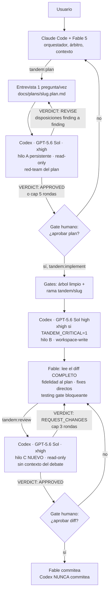

# Arquitectura de tandem

## El esquema



## Regla de hilos

```
Mismo rol, rondas sucesivas  → mismo hilo (el crítico recuerda sus hallazgos)
Cambio de rol                → hilo nuevo (el revisor final llega sin contaminar)
```

- Sol revisa el plan, Fable corrige, Sol re-revisa → **hilo A** siempre.
- Empieza la implementación → **hilo B** nuevo (Sol, effort high).
- Review final del código → **hilo C** nuevo (Sol), clave de estado `cr-<slug>`.
- El implementador nunca aprueba su propia implementación.

## Protocolo de conversación entre modelos

Nunca "discutid hasta acordar". Cada ronda es: crítica estructurada (P1/P2 o Critical→Suggestion, con evidencia file:line) → Fable arbitra cada hallazgo (ACCEPTED con el cambio / REJECTED con la razón) → el MISMO hilo re-verifica solo sus hallazgos y lo nuevo. Sentinel machine-parseable en la última línea (`VERDICT: …`, `IMPLEMENTATION_…`). Loops acotados (plan 5, code review 3, continuaciones 2). Deadlock = resultado legítimo que se muestra al usuario con ambas posiciones.

## Por qué CLI y no MCP (fase 1 → fase 2)

**Fase 1 (esta)**: `codex exec` vía scripts endurecidos. Verificado contra el código fuente de la CLI (2026-07):

- `codex exec resume` NO define `--sandbox`/`--model` propios; las opciones compartidas van en el padre: `codex exec --sandbox read-only … resume <id> …`. Los scripts además fuerzan `-c sandbox_mode=…` como cinturón y tirantes. Así ninguna reanudación hereda el default del `config.toml` del usuario (el fallo principal de TRIP-workflow).
- Prompt por stdin desde archivo (`- <file`): elimina cuelgues de stdin no-TTY y bugs de quoting a la vez.
- `--output-last-message` por turno con pre-borrado: imposible leer un veredicto rancio de una ronda anterior.
- Eventos y stderr capturados POR TURNO en `.tandem/state/…` (nunca `2>/dev/null`): los fallos de auth/red/modelo son visibles.
- Detección del fallback silencioso de `resume` (un id corrupto puede adjuntarse a otra sesión): si el turno reporta un `thread_id` distinto del pedido, fallo duro.

**Fase 2 (roadmap)**: sustituir los scripts por el servidor MCP oficial (`codex mcp-server`, tools `codex` y `codex-reply` con parámetros `model`, `sandbox`, `cwd`, `approval-policy`, `threadId`). Las skills no cambian de lógica — solo de transporte. Registro cuando se decida migrar:

```bash
claude mcp add --scope user --transport stdio codex -- codex mcp-server
```

No se registra en el plugin todavía para no arrancar un proceso codex en cada sesión de cada proyecto mientras el transporte oficial de las skills sea la CLI.

**Fase 3 (roadmap)**: orquestador programático (Claude Agent SDK + Codex SDK/MCP) para CI, presupuestos y trazas — solo cuando el flujo esté estabilizado en uso real.

## Decisiones que difieren de los repos analizados

| Decisión | Motivo |
| --- | --- |
| Estado en `.tandem/` del proyecto, no dentro del plugin | El plugin instalado es de solo lectura y su ruta cambia en cada update; TRIP guardaba estado dentro de `.claude/skills/` |
| Sin `--yolo` ni `danger-full-access` en ningún caso | `grill-me-codex` da bypass total al implementador; `workspace-write` basta y contiene el radio de daño |
| Sandbox re-fijado en cada resume | TRIP asumía herencia; el comportamiento real depende de la versión de la CLI y del config del usuario |
| Rutas de salida por turno, nunca `/tmp` fijo | Los archivos fijos de grill colisionan entre sesiones y sirven veredictos rancios si un resume falla |
| Thread IDs persistidos a disco | En grill viven solo en la conversación: una compactación de Claude los pierde |
| Release fuera del alcance | TRIP impone SemVer+tag+ff-merge; cada proyecto tiene su propia política de integración |
| Promoción del review opcional (`docs/reviews/`, `TANDEM_PROMOTE_REVIEWS`) | TRIP la hace obligatoria en su release; tandem no impone artefactos, pero sin promoción el veredicto solo vive en `.tandem/` efímero |
| Sin copia de archivos de TRIP | TRIP no tiene LICENSE efectiva (badge MIT con enlace muerto); solo se reutilizan ideas |
| Codex escribe los tests que el plan especifica | TRIP se los prohíbe; congelar los casos de aceptación en el plan y dejar que Fable añada casos independientes da mejor cobertura |

## Matriz de riesgo recomendada

| Trabajo | Flujo |
| --- | --- |
| Trivial (pocas líneas, docs) | Fable directamente, sin tandem |
| Feature normal | `tandem:run` con defaults (Sol `high` implementa) |
| Auth, migraciones, pagos, multi-tenancy, concurrencia | `tandem:run` con `TANDEM_CRITICAL=1`, review nunca omitida |
| Assets de imagen (iconos, sprites, mockups) | `tandem:image` — fuera del pipeline plan→review; gate visual de Fable + auditoría de escrituras |
| Destructivo o regulado | Lo anterior + aprobación humana adicional antes de cada fase |
