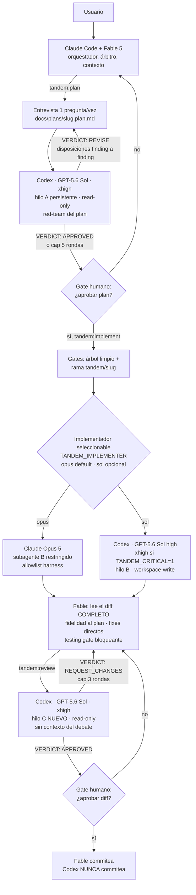

# Arquitectura de tandem

## El esquema



## Regla de hilos

```
Mismo rol, rondas sucesivas  → mismo hilo (el crítico recuerda sus hallazgos)
Cambio de rol                → hilo nuevo (el revisor final llega sin contaminar)
```

- Sol revisa el plan, Fable corrige, Sol re-revisa → **hilo A** siempre.
- Empieza la implementación → **hilo/subagente B** nuevo. Con el default `opus`, es `tandem:implementer` (o `tandem:implementer-critical` con `effort: xhigh` bajo `TANDEM_CRITICAL=1` — desde v0.21, con gate de versión Claude Code ≥ 2.1.111) y sus rondas continúan vía `SendMessage`; con `TANDEM_IMPLEMENTER=sol`, es el hilo Codex CLI existente (Sol, effort high).
- Review final del código → **hilo C** nuevo (Sol), clave de estado `cr-<slug>`.
- El implementador nunca aprueba su propia implementación.

El hilo B Opus tiene espejo durable en `.tandem/state/implement-claude/<slug>.json`: agent id/nombre, rondas consumidas, último sentinel e informe, worktree e identidad del intento (`plan_path`, `plan_hash`, `branch`). `plan_hash` siempre es `git rev-parse HEAD:docs/plans/<slug>.plan.md`, el blob commiteado; nunca la working copy que cambia al marcar checkboxes. Identidad coincidente permite reanudar o un reset deliberado; mismatch solo permite descartar o parar. Ningún reset usa `SendMessage` como sonda ni ocurre sin agente inactivo comprobado y, si está registrado, worktree limpio. Ante incertidumbre autonomous termina `FAILED` preservando el estado.

## Protocolo de conversación entre modelos

Nunca "discutid hasta acordar". Cada ronda es: crítica estructurada (P1/P2 o Critical→Suggestion, con evidencia file:line) → Fable arbitra cada hallazgo (ACCEPTED con el cambio / REJECTED con la razón) → el MISMO hilo re-verifica solo sus hallazgos y lo nuevo. Sentinel machine-parseable en la última línea (`VERDICT: …`, `IMPLEMENTATION_…`). Loops acotados (plan 5, code review 3, continuaciones 2). Deadlock = resultado legítimo que se muestra al usuario con ambas posiciones.

## Transportes actuales y por qué CLI, no MCP (fase 1 → fase 2)

El implementador default usa un subagente Claude `model: opus` con allowlist de harness (`Read, Edit, Write, Glob, Grep, Bash`), sin MCP, web ni Agent anidado. Esa frontera no es un sandbox OS: Bash conserva capacidad residual para ejecutar comandos que la sesión permita. El system prompt y el template prohíben commit/push/cambios de rama o remoto y fijan una única ruta absoluta; Fable compara después rama, `HEAD` y remotos antes del gate. Con `TANDEM_WORKTREE=1`, prompt, verificación y testing gate quedan anclados al cwd absoluto del worktree. Agent no expone effort por llamada, pero el frontmatter del agent type sí (Claude Code ≥ 2.1.111): desde v0.21, `TANDEM_CRITICAL=1` bajo opus selecciona `tandem:implementer-critical` (copia byte a byte del implementer con `effort: xhigh` — paridad fijada por test) con el tipo EFECTIVO persistido en el attempt state (`agent_type`, enum cerrado, recovery mismo-modo, mismatch → consent/FAILED). La review sigue siendo obligatoria; los efforts mostrados son siempre los EFECTIVOS (los overrides `TANDEM_IMPLEMENT_EFFORT` y `CLAUDE_CODE_EFFORT_LEVEL` tienen precedencia y el doctor lo refleja).

**Fase 1 (esta)**: Sol sigue usando `codex exec` vía scripts endurecidos para plan/review/ask y para implementación cuando `TANDEM_IMPLEMENTER=sol`. Verificado contra el código fuente de la CLI (2026-07):

- `codex exec resume` NO define `--sandbox`/`--model` propios; las opciones compartidas van en el padre: `codex exec --sandbox read-only … resume <id> …`. Los scripts además fuerzan `-c sandbox_mode=…` como cinturón y tirantes. Así ninguna reanudación hereda el default del `config.toml` del usuario (el fallo principal de TRIP-workflow).
- Prompt por stdin desde archivo (`- <file`): elimina cuelgues de stdin no-TTY y bugs de quoting a la vez.
- `--output-last-message` por turno con pre-borrado: imposible leer un veredicto rancio de una ronda anterior.
- Eventos y stderr capturados POR TURNO en `.tandem/state/…` (nunca `2>/dev/null`): los fallos de auth/red/modelo son visibles.
- Detección del fallback silencioso de `resume` (un id corrupto puede adjuntarse a otra sesión): si el turno reporta un `thread_id` distinto del pedido, fallo duro.

### Pins de argv: qué NO puede heredar un turno de tandem

Los tres wrappers (`codex-start.sh`, `codex-resume.sh`, `codex-swarm.sh`) llevan el mismo bloque de política en posición fija, generado por un único helper (`codex_pins()` en `scripts/_pins.sh`, sourceado por `_common.sh` y también por `codex-doctor.sh --smoke`) y congelado byte a byte por la suite:

| Pin | Por qué |
| --- | --- |
| `--ignore-user-config` | Pinear claves una a una nunca cubre lo que no se enumera: servidores MCP con capacidad de red, claves futuras. Ignorar el `config.toml` del usuario elimina la clase entera; el login sobrevive porque auth usa `CODEX_HOME` |
| `--ignore-rules` | Lo mismo para los ficheros execpolicy `.rules` de usuario o proyecto |
| `-c sandbox_mode=<sandbox>` | Cinturón del `--sandbox`, ahora en los tres scripts y no solo en resume |
| `-c sandbox_workspace_write.network_access=false` | Los comandos del sandbox se quedan sin red |
| `-c sandbox_workspace_write.writable_roots=[]` | `--cd` aporta la raíz primaria, pero los roots configurados se AÑADEN: sin este pin, un `writable_roots` heredado mantiene escribible el checkout principal desde un turno anclado al worktree |
| `-c approval_policy=never -c approvals_reviewer=user` | Con `approvals_reviewer=auto_review` en el config del usuario, un turno headless deja de forzar `never` y las peticiones de escape de sandbox o de red pasan a ser auto-aprobables |
| `-c web_search=disabled` (solo roles de escritura) | `network_access` gobierna la red de los comandos, no la herramienta nativa de búsqueda; sin el pin, `implement.tpl` prometería "sin red" en falso |

Los `-c` **siguen aplicándose y validándose** con `--ignore-user-config` puesto: flag y pins son complementarios, y los pins explícitos quedan como defensa en profundidad y declaración de intención verificable. Coste aceptado y deliberado: la personalización legítima del usuario (modelo por defecto, MCP propios) no llega a los turnos de tandem.

Los roles read-only (`review`, `ask`, y todos los asientos `ultra`) conservan la búsqueda web **sin pin**, por decisión de gate humano: un asiento que no puede escribir conserva capacidad útil y, con el config del usuario ignorado, su comportamiento pasa a ser el default determinista de la CLI. Residual documentado: un asiento read-only con búsqueda activa podría transmitir contenido del repo en una query.

Los temp roots (`/tmp`, `$TMPDIR`) siguen escribibles a propósito (`exclude_*` en su default `false`): las herramientas los necesitan y no son el árbol del proyecto. Lo que prohíbe escribir fuera de la raíz de trabajo es el lenguaje del prompt, no el sandbox.

### Verificar una clave de config sin gastar cuota

`codex debug prompt-input -c <clave>=<valor> hola` valida la configuración y sale **sin llamar al modelo**. Aviso crítico: una clave *desconocida* se acepta EN SILENCIO con rc 0 (`-c web_search_mode=disabled` no falla — simplemente no hace nada; la clave real es `web_search`). Por eso una clave solo se da por viva cuando **rechaza un valor inválido**, nunca porque acepte el override.

`scripts/config-probe.sh` automatiza justo eso para las cinco claves pineadas, bajo un `CODEX_HOME` temporal y borrado con `trap EXIT` (`debug prompt-input` no acepta `--ignore-user-config`, que es exclusivo de `codex exec`, así que el aislamiento se consigue con un home vacío). Usa `debug prompt-input` y nunca `codex exec`: con `exec`, el caso que el probe existe para detectar — la clave desaparecida — aceptaría el override y arrancaría un turno real. El job `config-drift` lo ejecuta semanalmente contra la CLI pineada y contra `@latest`, que es lo que convierte un rename silencioso en una señal. Ese job va **sin gate de secret** a propósito: el probe no necesita credenciales, y dejarlo dentro del `codex-smoke` gateado significaría que un repo sin `OPENAI_API_KEY` nunca se entera de que un pin dejó de aplicar.

### Raíz de trabajo: ejecución en el worktree, estado en el principal

`TANDEM_CODEX_CWD` (opcional) fija el directorio del turno vía `codex exec --cd`, como un único token y sin normalización propia. `CLAUDE_PROJECT_DIR` **no** se reapunta: el estado de hilos y el heartbeat siguen bajo el checkout principal, así que `codex-show`/`codex-reset` funcionan desde ahí y borrar el worktree no destruye el hilo — se recrea y el mismo hilo reanuda.

`scripts/worktree-root.sh <slug>` es quien resuelve esa raíz y lo que ambas skills invocan: sin `TANDEM_WORKTREE=1` imprime el checkout principal; con él, la ruta del worktree **registrado** para `refs/heads/tandem/<slug>` leída de `git worktree list` — no la convención `.worktrees/<slug>`, que un worktree reutilizado en otra ruta rompería. Cero coincidencias, varias, o una ruta registrada ausente del disco son error duro (65): jamás un fallback silencioso al principal. `TANDEM_WORKTREE` gobierna **la aprobación del plan e implement/review**: desde 0.12, `scripts/plan-approve.sh` crea `tandem/<slug>` en la aprobación y el flag decide dónde aterriza el commit del plan (in-place en el checkout principal, o movido a `.worktrees/<slug>` con el worktree creado ya en ese momento), con estado durable en `.tandem/state/plan-approve/<slug>.json` y el modo real derivado de `git worktree list` — un mismatch con el entorno es error duro, nunca una adivinanza. `ask` e `image` no se anclan y no hay que esperar aislamiento ahí.

**Fase 2 — EN CURSO desde v0.27.0 (M20a: rol `ask`).** `TANDEM_TRANSPORT=mcp` enruta el
turno de ARRANQUE de `ask` por `codex mcp-server` (opt-in; el default sigue siendo `exec`,
byte a byte). Forma decidida por la auditoría (docs/audits/fase2-mcp-parity.md) y probada
con cuota real en M19: **wrappers como clientes MCP**, no el servidor registrado en la
sesión — así se conservan el ledger de tokens, los artefactos por turno y el aislamiento.
**Un servidor por turno:** `codex-reply` no cruza invocaciones (el hilo muere con el
proceso), así que las CONTINUACIONES usan el híbrido `codex exec resume` — el rollout que
el arranque MCP realoja al store real del usuario es todo lo que necesita, y el turno lo
registra honesto (`transport_effective: "exec-resume"`). Un CODEX_HOME efímero propiedad
de tandem (config.toml solo con los pins; model y effort viajan como params del call)
aporta el aislamiento que el servidor no ofrece: no existe `--ignore-user-config` en
mcp-server. Watchdog por turno OBLIGATORIO (540 s, por debajo del timeout de las skills):
una aprobación de MCP-tool bajo `never` cuelga sin timeout y el cliente MCP no puede
resolverla. Pendiente: `review` (M20b) e `implement`/swarm (M20c).

**Fase 2 (resto del roadmap)**: sustituir los scripts Codex por el servidor MCP oficial (`codex mcp-server`, tools `codex` y `codex-reply` con parámetros `model`, `sandbox`, `cwd`, `approval-policy`, `threadId`). Las skills no cambian de lógica — solo de transporte. Registro cuando se decida migrar:

```bash
claude mcp add --scope user --transport stdio codex -- codex mcp-server
```

No se registra en el plugin todavía para no arrancar un proceso codex en cada sesión de cada proyecto mientras el transporte oficial de las skills sea la CLI.

**El instrumento de decisión de esa fase es `scripts/mcp-probe.sh`**, no una opinión: levanta un `codex mcp-server` bajo un `CODEX_HOME` efímero propiedad de tandem (config.toml espejo de `codex_pins()`, `auth.json` copiado con `chmod 600` y borrado por los traps — nunca entra en `.tandem/`), habla ndjson JSON-RPC en bash puro y emite una línea parseable por probe: **b** (¿autentica el token copiado en un home propio?), **c** (¿`codex-reply` hereda el config CONGELADO de la primera llamada?, discriminado por el `turn_context` del rollout y no por lo que diga el modelo), **a** (¿sobrevive el hilo a la muerte del servidor vía `codex exec resume`?) y **d** (elicitation bajo `never`, cerrada en fuente). Los veredictos son `PASS | FAIL | INDETERMINABLE | STATIC | NOT_RUN`; un vencimiento de watchdog es SIEMPRE `INDETERMINABLE` y nunca verde. Gasta los 3 turnos reales **solo** con `--spend` (mismo criterio que `doctor --smoke`: el preflight y el veredicto `STATIC` son gratis, y `STATIC` exige que `codex --version` sea exactamente la versión auditada), respeta el DAG `b → c → a` saltando dependientes sin gastar, y archiva toda la evidencia bajo `.tandem/state/mcp-probe/<run>/`. El registro durable de resultados no es el script: es `docs/audits/fase2-mcp-parity.md`, que el orquestador actualiza con las líneas `PROBE …` del run real.

**Fase 3 (roadmap)**: orquestador programático (Claude Agent SDK + Codex SDK/MCP) para CI, presupuestos y trazas — solo cuando el flujo esté estabilizado en uso real.

## Decisiones que difieren de los repos analizados

| Decisión | Motivo |
| --- | --- |
| Opus 5 implementa por defecto; Sol sigue red-team/review | Separa las familias generador/revisor; `TANDEM_IMPLEMENTER=sol` restaura el transporte anterior |
| Allowlist harness para Opus, sandbox OS para Sol | El agent type elimina MCP/web/Agent, pero Bash queda como riesgo residual explícito; equivalencia total con `workspace-write` queda fuera de v1 |
| Estado en `.tandem/` del proyecto, no dentro del plugin | El plugin instalado es de solo lectura y su ruta cambia en cada update; TRIP guardaba estado dentro de `.claude/skills/` |
| Sin `--yolo` ni `danger-full-access` en ningún transporte Codex | `grill-me-codex` da bypass total al implementador; para Sol, `workspace-write` basta y contiene el radio de daño |
| Sandbox re-fijado en cada resume | TRIP asumía herencia; el comportamiento real depende de la versión de la CLI y del config del usuario |
| Rutas de salida por turno, nunca `/tmp` fijo | Los archivos fijos de grill colisionan entre sesiones y sirven veredictos rancios si un resume falla |
| Thread IDs persistidos a disco | En grill viven solo en la conversación: una compactación de Claude los pierde |
| Release fuera del alcance | TRIP impone SemVer+tag+ff-merge; cada proyecto tiene su propia política de integración |
| Promoción del review opcional (`docs/reviews/`, `TANDEM_PROMOTE_REVIEWS`) | TRIP la hace obligatoria en su release; tandem no impone artefactos, pero sin promoción el veredicto solo vive en `.tandem/` efímero |
| Sin copia de archivos de TRIP | TRIP no tiene LICENSE efectiva (badge MIT con enlace muerto); solo se reutilizan ideas |
| Codex escribe los tests que el plan especifica | TRIP se los prohíbe; congelar los casos de aceptación en el plan y dejar que Fable añada casos independientes da mejor cobertura |

## Matriz de riesgo recomendada

| Trabajo | Flujo |
| --- | --- |
| Trivial (pocas líneas, docs) | Fable directamente, sin tandem |
| Feature normal | `tandem:run` con defaults (Opus 5 implementa; Sol revisa) |
| Rollback al transporte anterior | `TANDEM_IMPLEMENTER=sol tandem:run` (Sol `high` implementa) |
| Auth, migraciones, pagos, multi-tenancy, concurrencia | `tandem:run` con `TANDEM_CRITICAL=1`, review nunca omitida; el effort sube a xhigh bajo `sol` Y bajo opus (`tandem:implementer-critical`, Claude Code ≥ 2.1.111; los overrides de effort tienen precedencia — el doctor muestra el efectivo) |
| Assets de imagen (iconos, sprites, mockups) | `tandem:image` — fuera del pipeline plan→review; gate visual de Fable + auditoría de escrituras |
| Destructivo o regulado | Lo anterior + aprobación humana adicional antes de cada fase |

## Sesgo del árbitro con Opus

Con el transporte default, Fable arbitra hallazgos de Sol sobre código producido por otro modelo Claude. Esa cercanía de familia puede introducir sesgo. La mitigación es procedimental y no se relaja: cada hallazgo de Sol debe traer evidencia `file:line`, y Fable debe registrar una disposición razonada finding a finding antes de aceptar o rechazarlo. Los gates humanos permanecen intactos.

La segunda línea de la status line la disputa una selección de ganador: un turno Codex VIVO (pid comprobado) la tiene siempre; entre estados no vivos (heartbeat terminal en su ventana de 900 s, orphaned, o el attempt state Opus de `.tandem/state/implement-claude/`) gana el timestamp más reciente, con empates deterministas. Durante una implementación Opus muestra presencia y desenlace (`⚒ running` / sentinel coloreado / `⚠ sin señal` a las 2 h) leídos del JSON durable — nunca actividad en vivo, que sigue siendo v2; Claude Code muestra además el progreso nativo del subagente.
